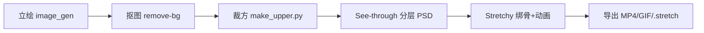

# 01 · 管线总览与选型理由

## 目标

把一张二次元角色立绘变成**骨骼驱动、可循环、可在编辑器继续改**的 Live2D 风格动画（转头 / 眨眼 / 呼吸），并用 MP4/GIF 交付给用户。

## 为什么选这条管线（对比过什么）

| 方案 | 结果 | 结论 |
|---|---|---|
| 本机 Cubism Editor 5.3.04 | splash 卡死，不可用 | ✗ 放弃（无 Nvidia GPU，CPU + AMD 780M 也不利于本机 AI 分层） |
| psd2live / Bunraku | 无可用代码 / 无脚本接口 | ✗ 放弃 |
| DWPose AI auto-rig（Stretchy 内置） | ONNX 模型下载损坏（protobuf parsing failed） | ✗ 不可用 → 手动校正骨骼 |
| **See-through（HF Space）→ Stretchy Studio** | **可用，全在线，产出标准 PSD + .stretch 工程** | ✅ **采用** |

## 管线六步

1. **立绘**：文生图模型生成 1597×1597 透明底角色立绘（上半身，头肩构图）。
2. **抠图**：`mediakit-cli image remove-image-background`，输出透明底 PNG。
3. **裁方**：`scripts/make_upper.py` 裁成 1597×1597 方形（Stretchy / See-through 都要求方形，否则网格坐标会歪）。
4. **分层**：HuggingFace **See-through** Space 上传 PNG → Run → 下载 `seethrough_output.psd`（22 层：前发/五官/眼白/瞳孔/衣物/后发…）。
5. **绑骨+动画**：Stretchy Studio 在线完成（见 03 / 04 篇）。
6. **导出**：Export frames 出 48 张透明 PNG → ffmpeg 合成 MP4 / GIF；Save project 出 `.stretch` 可编辑工程。

## 关键决策

- **方形画布**：全链路统一 768×768 或 1597×1597，避免坐标系换算错误。
- **在线工具优先**：本机环境受限时，全部用浏览器可操作的工具，且每一步都有可回读的产物（PSD / 帧 PNG / .stretch），保证可验证、可回滚。
- **人工校正不可避免**：AI 自动绑骨的关节位置（尤其 head / eyes 的 pivot）几乎必然要手动修正，这是动画质量的分水岭。
